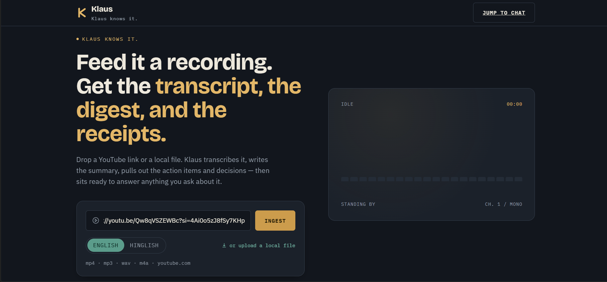
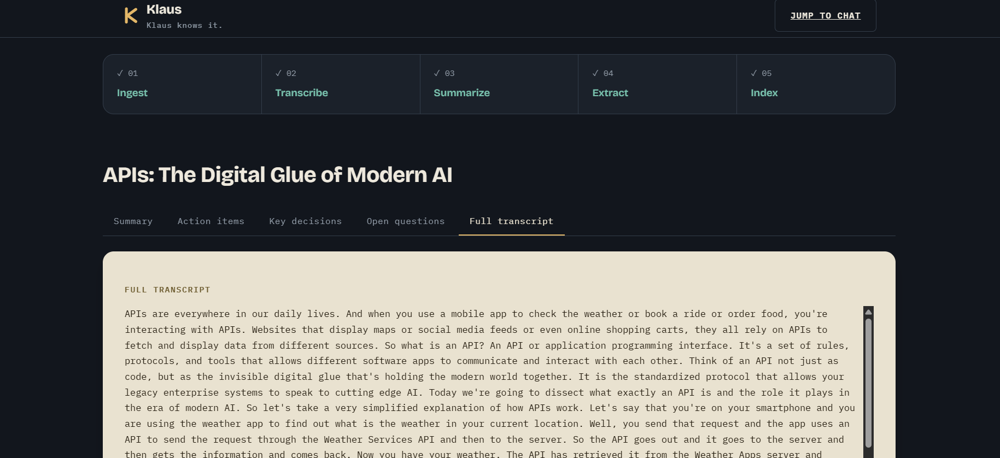
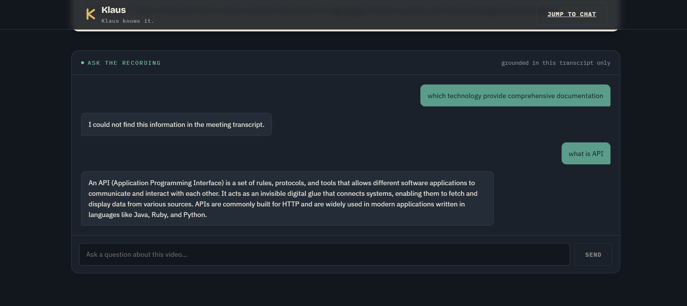

# Klaus — AI Video Agent

**Klaus knows it.**



Klaus turns a video — a YouTube link or a local file — into a transcript, a summary, extracted action items and key decisions, open questions, and a chat interface to ask follow-up questions grounded in that transcript (RAG).

## Features

- **Input** — accepts a YouTube URL or an uploaded local video/audio file
- **Transcription** — local Whisper model for English; [Sarvam AI](https://www.sarvam.ai/) API for Hinglish
- **Summarization** — auto-generated title + summary of the video
- **Extraction** — action items, key decisions, and open questions pulled from the transcript
- **Chat (RAG)** — ask questions about the video; answers are grounded in the transcript via a ChromaDB vector store
- **UI** — a React frontend with live pipeline progress (Ingest → Transcribe → Summarize → Extract → Index)

## Screenshots

| Results | Chat |
|---|---|
|  |  |
|  |

## Tech stack

- **Backend:** Python, FastAPI
- **Transcription:** Whisper (local model, English) + Sarvam AI API (Hinglish)
- **Vector store:** ChromaDB
- **Frontend:** React + Vite

## Project structure

```
AI-Video-Agent/
├── core/
│   ├── extractor.py       # action items / decisions / open questions extraction
│   ├── rag_engine.py       # builds the RAG chain and answers questions
│   ├── summarizer.py       # title + summary generation
│   ├── transcriber.py      # Whisper (English) + Sarvam AI API (Hinglish) transcription
│   └── vector_store.py     # ChromaDB embeddings / vector index for RAG
├── utils/
│   └── audio_processor.py  # handles YouTube/local-file ingestion and chunking
├── frontend/                # React + Vite UI
│   ├── src/
│   ├── index.html
│   ├── package.json
│   ├── package-lock.json
│   └── vite.config.js
├── main.py                  # CLI entry point (runs the pipeline end-to-end in the terminal)
├── server.py                 # FastAPI wrapper exposing the pipeline over HTTP for the UI
├── test.py                   # tests
├── requirements.txt
├── .env.example
└── .gitignore
```

## How it works

1. `utils/audio_processor.py` ingests the source (YouTube URL or local file) and chunks the audio.
2. `core/transcriber.py` transcribes the chunks — locally via Whisper for English, or via the Sarvam AI API for Hinglish.
3. `core/summarizer.py` generates a title and summary from the transcript.
4. `core/extractor.py` pulls out action items, key decisions, and open questions.
5. `core/vector_store.py` indexes the transcript into ChromaDB, and `core/rag_engine.py` builds the RAG chain that powers the chat.

`main.py` runs this pipeline as a CLI (with a terminal chat loop at the end). `server.py` wraps the same building blocks in a FastAPI app so the React frontend can drive it over HTTP, with live per-stage progress.

## Setup

**1. Clone and install backend dependencies**
```bash
git clone https://github.com/abhishekk016/Klaus-AI-Video-Agent.git
cd Klaus-AI-Video-Agent
pip install -r requirements.txt
```

**2. Configure environment variables**
```bash
cp .env.example .env
```
Fill in `.env` with:
- Your **Sarvam AI API key** (required for Hinglish transcription)
- Any other keys your `core/` modules need (e.g. for summarization/extraction LLM calls)

**3. Install frontend dependencies**
```bash
cd frontend
npm install
cd ..
```

## Running

**Option A — CLI**
```bash
python main.py
```

**Option B — Web app**

Terminal 1 (backend):
```bash
uvicorn server:app --reload --port 8000
```

Terminal 2 (frontend):
```bash
cd frontend
npm run dev
```

Open the printed local URL (typically `http://localhost:5173`).

## Notes

- English transcription uses a local Whisper model, so first-time setup will download model weights, and transcription runs on CPU unless you have a configured GPU environment.
- Hinglish transcription is routed to the Sarvam AI API instead, so it requires a valid `SARVAM_API_KEY` in `.env` and an internet connection.
- ChromaDB persists the transcript's vector index locally; the chat feature only answers from the current video's transcript — it's retrieval-grounded, not general knowledge.

## License

MIT
